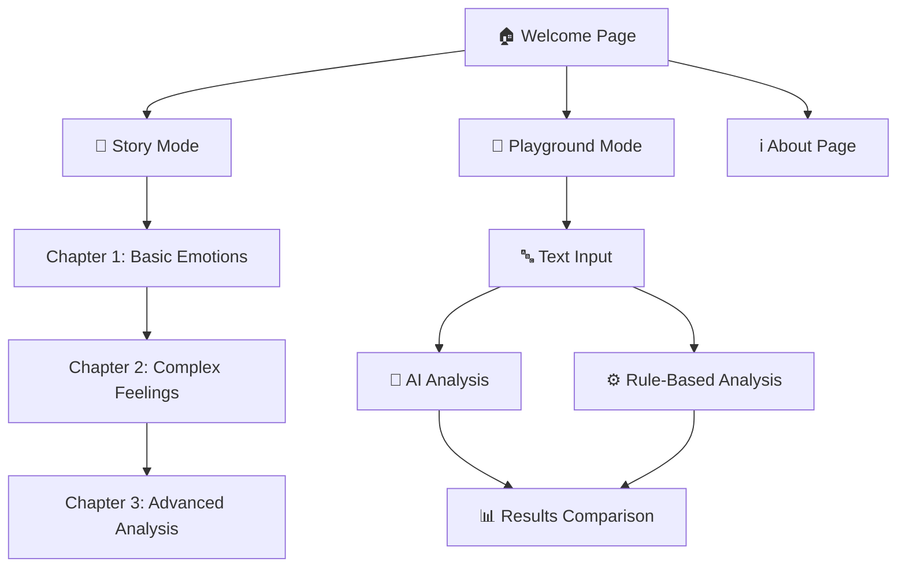

<div align="center">

# 🕵️‍♀️ The Emotion Detective

**An Enchanting Journey into Sentiment Analysis for Young Minds**

[](https://reactjs.org/)
[](https://nodejs.org/)
[](https://expressjs.com/)
[](LICENSE)

*Transform the complex world of sentiment analysis into an interactive adventure designed specifically for 6th-grade students*

[🚀 Live Demo](https://emotion-detective-1.onrender.com/) • [📖 Documentation](#features) • [🎮 Try It Now](#quick-start)

</div>

---

## ✨ What Makes This Special?

**The Emotion Detective** isn't just another educational tool—it's a magical journey where students become emotion detectives, solving mysteries through the power of sentiment analysis. By combining storytelling with cutting-edge technology, we make complex AI concepts accessible and exciting for young learners.

<div align="center">
  
</div>

---

## 🎯 Features That Wow

### 🏰 **Interactive Story Mode**
- 📚 Follow Detective Emma through 3 enchanted chapters
- 🎭 Beautiful character animations and magical environments
- 🏆 Progress tracking with achievement rewards
- 🔓 Chapter unlocking system to maintain engagement

### 🔬 **Playground Mode**
- 🧪 Hands-on experimentation with real sentiment analysis
- 📝 Try your own text or use curated examples
- ⚖️ Compare rule-based vs AI-powered analysis methods
- 📊 Visual feedback and detailed explanations

### 🤖 **Dual Analysis Engine**
- 🔧 **Rule-Based Analysis**: Traditional keyword matching approach
- 🧠 **AI-Powered Analysis**: Advanced machine learning using Groq AI
- 📈 Side-by-side comparison for educational insights
- 💡 Clear explanations of how each method works

### 🎨 **Stunning User Experience**
- 🌈 Beautiful gradient themes and animations
- 🌙 Dark/Light mode toggle
- 📱 Fully responsive design for all devices
- ✨ Smooth transitions and micro-interactions

---

## 🛠️ Tech Stack & Architecture

<div align="center">

### Frontend Powerhouse
| Technology | Purpose | Version |
|------------|---------|---------|
| ⚛️ **React** | UI Framework | 18.x |
| ⚡ **Vite** | Build Tool | 4.x |
| 🎨 **Tailwind CSS** | Styling | 3.x |
| 🎬 **Framer Motion** | Animations | 10.x |
| 🎯 **Lucide React** | Icons | Latest |

### Backend Infrastructure
| Technology | Purpose | Version |
|------------|---------|---------|
| 🟢 **Node.js** | Runtime | 18.x |
| 🚂 **Express** | Web Framework | 4.x |
| 🤖 **Groq AI** | AI Analysis | Latest API |
| 🔒 **CORS** | Security | Latest |

</div>

---

## 🚀 Quick Start

### 📋 Prerequisites
- 🟢 Node.js (v18 or higher)
- 📦 npm or yarn
- 🔑 Groq AI API key (for AI analysis)

### 🔧 Installation

#### 1️⃣ Clone the Repository
```bash
git clone https://github.com/yourusername/emotion-detective.git
cd emotion-detective
```

#### 2️⃣ Backend Setup
```bash
# Navigate to backend
cd backend

# Install dependencies
npm install

# Create environment file
cp .env.example .env

# Add your API keys to .env
GROQ_API_KEY=your_groq_api_key_here
NODE_ENV=development
PORT=5001
CORS_ORIGIN=http://localhost:5173

# Start the server
npm run dev
```

🟢 **Backend running at:** `http://localhost:5001`

#### 3️⃣ Frontend Setup
```bash
# Navigate to frontend
cd ../frontend

# Install dependencies
npm install

# Create environment file
echo "VITE_API_URL=http://localhost:5001" > .env

# Start the development server
npm run dev
```

🌐 **Frontend running at:** `http://localhost:5173`

---

## 📚 How Students Learn

### 🎓 Educational Journey

<div align="center">



</div>

### 🎯 Learning Objectives

| Chapter | Skills Developed | Tools Introduced |
|---------|------------------|------------------|
| **Chapter 1** 🌟 | Basic emotion recognition | Rule-based analysis |
| **Chapter 2** 🌊 | Complex sentiment understanding | Enhanced pattern recognition |
| **Chapter 3** ⚡ | Advanced analysis techniques | AI-powered analysis |

---

## 🌟 Educational Impact

### 👨‍🎓 **For Students**
- 🧠 **Critical Thinking**: Analyze text for emotional content
- 💻 **Tech Literacy**: Understand AI and machine learning basics
- 🎯 **Problem Solving**: Detective work through sentiment puzzles
- 🤝 **Communication**: Better understanding of emotional expression

### 👩‍🏫 **For Educators**
- 📋 **Curriculum Integration**: Fits perfectly into computer science and language arts
- 📊 **Progress Tracking**: Built-in assessment tools
- 🎨 **Engagement Tools**: Gamified learning experience
- 📱 **Accessibility**: Works on any device

---

## 🚀 Deployment Guide

### 🌐 Deploy on Render (Recommended)

#### Option 1: Automatic Deployment
1. **Fork this repository** to your GitHub account
2. **Connect to Render** - Link your GitHub repository
3. **Configure Environment Variables**:
   ```env
   # Backend Service
   NODE_ENV=production
   GROQ_API_KEY=your_groq_api_key
   CORS_ORIGIN=https://your-frontend-url.onrender.com
   
   # Frontend Service
   VITE_API_URL=https://your-backend-url.onrender.com
   ```
4. **Deploy** - Render automatically builds and deploys!

#### Option 2: Manual Configuration

**Backend Service:**
```yaml
# render.yaml (already included)
- type: web
  name: emotion-detective-backend
  env: node
  plan: free
  buildCommand: cd backend && npm install
  startCommand: cd backend && npm start
```

**Frontend Service:**
```yaml
- type: web
  name: emotion-detective-frontend
  env: static
  buildCommand: cd frontend && npm install && npm run build
  staticPublishPath: ./frontend/dist
```

### 🔧 Other Deployment Options

<details>
<summary>📦 Deploy on Vercel</summary>

```bash
# Install Vercel CLI
npm i -g vercel

# Deploy frontend
cd frontend
vercel

# Deploy backend (serverless)
cd ../backend
vercel
```

</details>

<details>
<summary>🚀 Deploy on Netlify</summary>

```bash
# Build frontend
cd frontend
npm run build

# Deploy to Netlify
# Upload the 'dist' folder to Netlify
# Configure _redirects file for SPA routing
```

</details>

---

## 🎮 API Documentation

### 🔗 Endpoints

| Method | Endpoint | Description | Parameters |
|--------|----------|-------------|------------|
| `GET` | `/health` | Health check | None |
| `POST` | `/api/sentiment/analyze` | Analyze text sentiment | `text`, `method` |
| `GET` | `/api/story/chapters` | Get story chapters | None |

### 📝 Example Requests

```javascript
// Sentiment Analysis
const response = await fetch('/api/sentiment/analyze', {
  method: 'POST',
  headers: { 'Content-Type': 'application/json' },
  body: JSON.stringify({
    text: "I love this amazing app!",
    method: "both" // "rule", "ai", or "both"
  })
});

const result = await response.json();
console.log(result);
// Output: { ruleBased: {...}, aiBased: {...} }
```

---

## 🤝 Contributing

We welcome contributions from educators, developers, and anyone passionate about making learning fun! 

### 🎯 How to Contribute

1. **🍴 Fork the repository**
2. **🌱 Create a feature branch**
   ```bash
   git checkout -b feature/amazing-new-feature
   ```
3. **💫 Make your changes**
4. **✅ Test thoroughly**
5. **📝 Commit with clear messages**
   ```bash
   git commit -m "✨ Add amazing new feature"
   ```
6. **🚀 Push and create a Pull Request**

### 🎨 Contribution Ideas

- 📚 **New Story Chapters**: Create additional adventures
- 🎭 **Character Development**: Add new characters or animations
- 🔧 **Analysis Methods**: Implement new sentiment analysis techniques
- 🌍 **Internationalization**: Add support for other languages
- 📱 **Mobile Features**: Enhance mobile experience
- 🎮 **Gamification**: Add more interactive elements

---

## 📜 License & Credits

### 📄 License
This project is licensed under the **MIT License** - see the [LICENSE](LICENSE) file for details.

### 🙏 Acknowledgments

- 🤖 **Groq AI** for powerful sentiment analysis capabilities
- 🎨 **Lucide Icons** for beautiful iconography
- 🎬 **Framer Motion** for stunning animations
- 🌟 **The Open Source Community** for inspiration and tools

---

## 📞 Support & Community

<div align="center">

### 💬 Get Help

[](https://discord.gg/your-server)
[](https://github.com/yourusername/emotion-detective/issues)
[](mailto:your-email@example.com)

### 🌟 Show Your Support

If this project helps you teach or learn, please consider:
- ⭐ **Starring** this repository
- 🐛 **Reporting** any bugs you find
- 💡 **Suggesting** new features
- 📢 **Sharing** with other educators

</div>

---

<div align="center">

**Made with ❤️ for the next generation of AI explorers**

*Transform learning • Inspire curiosity • Build the future*

</div>


